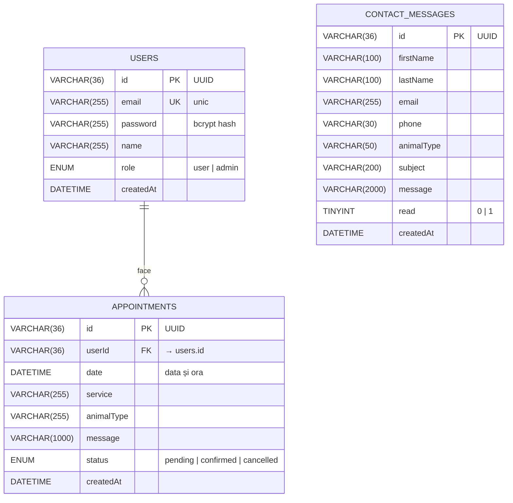

# 📊 Diagrama Entitate-Relație (ER)

Schema bazei de date `vetcare` (MySQL).

## Diagrama vizuală

> 💡 **Notă:** Mermaid se renderează automat pe GitHub și în multe editoare Markdown (VS Code cu extensia Mermaid). Pentru lucrare poți face screenshot la randarea grafică sau să exporți într-un editor online ([mermaid.live](https://mermaid.live)).

---

## Descrierea tabelelor

### 1. `users` — Utilizatori
Stochează conturile aplicației, atât pentru clienți obișnuiți cât și pentru administratori.

| Coloană | Tip | Constrângeri | Descriere |
|---------|-----|--------------|-----------|
| `id` | VARCHAR(36) | PRIMARY KEY | Identificator unic UUID v4 |
| `email` | VARCHAR(255) | NOT NULL, UNIQUE | Email login (case-insensitive) |
| `password` | VARCHAR(255) | NOT NULL | Hash bcrypt (10 rounds) |
| `name` | VARCHAR(255) | DEFAULT '' | Numele complet |
| `role` | ENUM | DEFAULT 'user' | `user` sau `admin` |
| `createdAt` | DATETIME | DEFAULT CURRENT_TIMESTAMP | Data înregistrării |

### 2. `appointments` — Programări
Stochează toate programările făcute de utilizatori la cabinet.

| Coloană | Tip | Constrângeri | Descriere |
|---------|-----|--------------|-----------|
| `id` | VARCHAR(36) | PRIMARY KEY | UUID v4 |
| `userId` | VARCHAR(36) | FK → users.id, ON DELETE CASCADE | Cine a făcut programarea |
| `date` | DATETIME | INDEX | Data și ora programării |
| `service` | VARCHAR(255) | — | Tipul serviciului (Consultație, Vaccinare, etc.) |
| `animalType` | VARCHAR(255) | DEFAULT '' | Câine, Pisică, etc. |
| `message` | VARCHAR(1000) | DEFAULT '' | Detalii suplimentare |
| `status` | ENUM | DEFAULT 'pending' | `pending` / `confirmed` / `cancelled` |
| `createdAt` | DATETIME | DEFAULT CURRENT_TIMESTAMP | Data creării |

### 3. `contact_messages` — Mesaje contact
Stochează mesajele trimise prin formularul de contact (de oricine, fără autentificare).

| Coloană | Tip | Constrângeri | Descriere |
|---------|-----|--------------|-----------|
| `id` | VARCHAR(36) | PRIMARY KEY | UUID v4 |
| `firstName` | VARCHAR(100) | NOT NULL | Prenume |
| `lastName` | VARCHAR(100) | NOT NULL | Nume |
| `email` | VARCHAR(255) | NOT NULL, INDEX | Email pentru răspuns |
| `phone` | VARCHAR(30) | DEFAULT '' | Telefon (opțional) |
| `animalType` | VARCHAR(50) | DEFAULT '' | Tipul animalului (opțional) |
| `subject` | VARCHAR(200) | NOT NULL | Subiectul mesajului |
| `message` | VARCHAR(2000) | NOT NULL | Conținutul |
| `read` | TINYINT(1) | DEFAULT 0, INDEX | 0 = necitit, 1 = citit |
| `createdAt` | DATETIME | DEFAULT CURRENT_TIMESTAMP | Data trimiterii |

---

## Relații și constrângeri

### `users` → `appointments` (1 : N)
- Un utilizator poate avea **multiple** programări.
- O programare aparține **unui singur** utilizator.
- `ON DELETE CASCADE`: dacă userul este șters, toate programările sale sunt șterse automat.

### `contact_messages` — fără relații
- Mesajele de contact pot fi trimise și de persoane care **nu au cont** în aplicație.
- Nu există foreign key către `users` deoarece email-ul completat în formular nu e neapărat al unui user înregistrat.

---

## De ce UUID în loc de auto-increment?

UUID-urile aduc trei beneficii:
1. **Securitate prin obscurat**: nu poți ghici că există userul cu id=2 sau programarea cu id=15.
2. **Scalabilitate**: pot fi generate pe client/server fără round-trip la DB.
3. **Migrare/merge**: dacă vreodată unești 2 baze de date, UUID-urile nu se ciocnesc.

Singurul minus e dimensiunea (36 chars vs 4 bytes pentru INT), dar pentru un cabinet veterinar nu contează.

---

## Indecși

- `users.email` — UNIQUE → căutare login rapidă
- `appointments.userId` — INDEX → JOIN-uri eficiente la "programările mele"
- `appointments.date` — INDEX → căutare ore ocupate într-o zi
- `contact_messages.email` — INDEX → căutare mesaje după email
- `contact_messages.read` — INDEX → filtrare mesaje necitite
